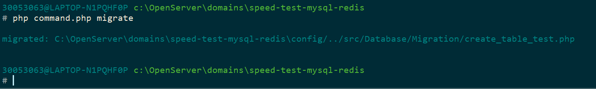
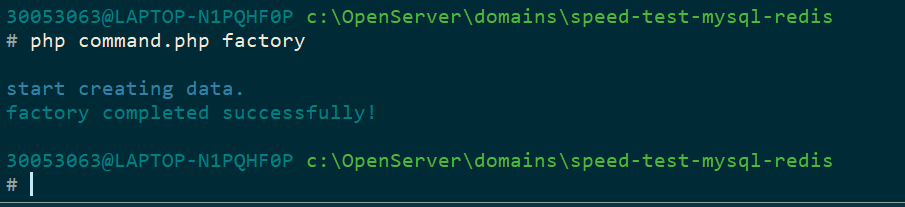
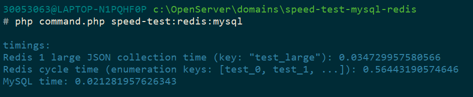
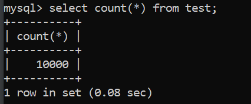

## Сравнение скорости выполнения выборки MySQL && Redis

### Требования
- PHP 8.0
- MySQL 8.0
- Redis 7.0

Приложение полностью выполняется при помощи консоли, то есть без вёрстки (поскольку я не вижу смысла делать интерфейс).
Для вызова команд необходимо обращаться к файлику `command.php` из корневой директории проекта.

В принципе, в файле `command.php` содержится вся бизнес логика проекта.

Так же в проекте используется 1 зависимость, а именно `fakerphp/faker`, для удобства создания тестовых данных.

Перед работой с проектом необходимо прописать `composer install`.
### Работа с проектом

1. **Настройка подключений**

для настройки подключения к базе mysql и redis, необходимо изменить файлики:
- `/config/database_connection.php` - подключение к mysql.
- `/config/redis_connection.php` - подключение к redis.

2. **Инициализация таблиц и данных**

Для инициализации таблицы `test` (где и хранятся данные для теста), необходимо выполнить команду `php command.php migrate`:

Она создаст необходимую таблицу в базе, сами миграции находится в `/src/Database/Migration`.

3. **Создание тестовых данных**

Количество создаваемых записей для тестовых данных зависит от конфига `/config/test_data.php` (вынесено для удобства тестирования),
если нет желания менять конфиг php отвечающий за максимальное время выполнения скрипта `max_execution_time` и ждать заполнение
базы данными, можно поставить более меньшие значения (по умполчанию как и в тз 100 000).

Для создания необходимо применить команду `php command.php factory`, она заполнит таблицу тест данными:

4. Тестирование

Для запуска тестового сравнения выборки, запускаем команду `speed-test:redis:mysql`, она выдаст в секундах время выполнения
3-ёх видов выборки:
- Выборка одной большой коллекции JSON из redis.
- Выборка данных по ключам, данные в ключах соответствуют данным из JSON коллекции про которую написал выше.
- Выборка всех данных из таблицы `test` без фильтров.

Пример результата теста (на 10к записей):

### Чтобы очистить все созданные данные введите `php command.php speed-test:redis:mysql:clear`